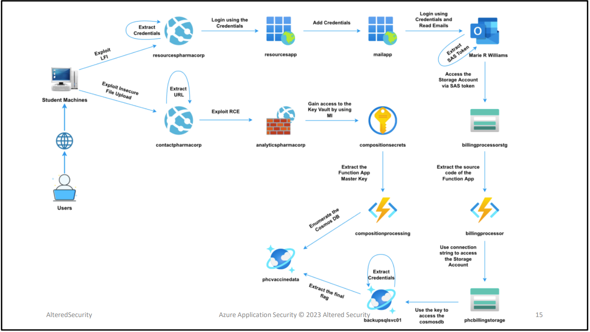

# CAWASP
Certification

## Index:

1. [Attack_lab_1](Attack_lab_1.md)
2. [Attack_lab_4](Attack_lab_4.md)
3. [Attack_lab_9](Attack_lab_9.md)
4. [Attack_lab_10](Attack_lab_10.md)


## Certification Lab Diagram:



## Certification Tools:

```
PS C:\AzAppsec\Tools> dir


    Directory: C:\AzAppsec\Tools


Mode                LastWriteTime         Length Name
----                -------------         ------ ----
d-----         7/1/2022   3:48 AM                AADInternals
d-----         7/1/2022   3:48 AM                Az
d-----         7/1/2022   3:48 AM                AzureAD
d-----         7/1/2022   3:48 AM                CosmosDB
d-----         7/1/2022   3:48 AM                MicroBurst
d-----         7/1/2022   3:48 AM                PowerZure
-a----         7/1/2022  11:25 AM       57475072 azure-cli-2.37.0.msi
-a----         7/1/2022  11:13 AM      244359176 burpsuite_community_windows-x64_v2022_5_2.exe
-a----         7/1/2022  11:24 AM      101020440 StorageExplorer.exe
-a----        6/17/2022   2:42 PM            667 studentx.jsp

```


